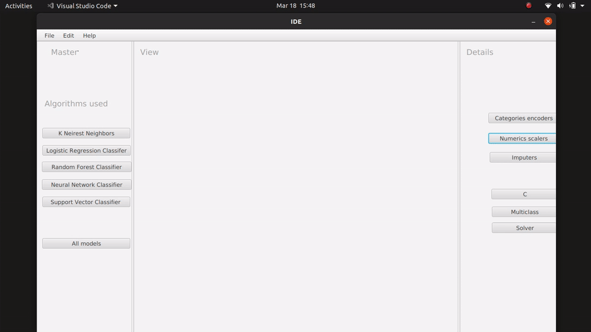
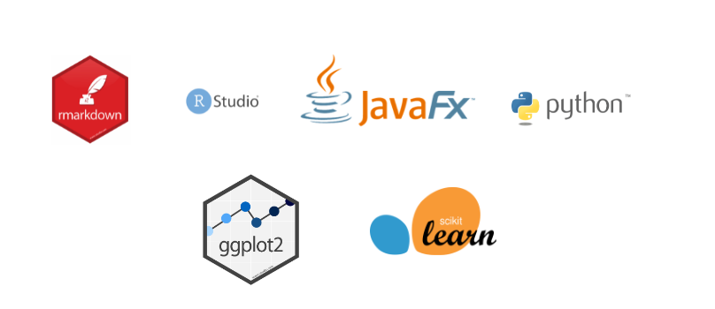

## Optimizer : Overview

## L'hyperparameter tuning, c'est quoi ?
Les hyperparamètres correspondent aux paramètres d’ajustement des algorithmes d’apprentissage automatisé ou de machine learning. C’est au concepteur de l’algorithme de les configurer (souvent le data scientist). Un algorithme d’apprentissage automatique ne peut en effet fonctionner sans ces hyperparamètres. Leur réglage (tuning) nécessite un travail statistique afin de déterminer ceux qui donneront le meilleur résultat.

Optimizer est une application-desktop qui aide les data-scientists a choisir entre les differents modèles (Model selection)  
Le but principale de l'application est de lancer une recherche (Grid Search) d'optimization des differents parametres avec aucun effort de la part de l'utilisateur de l'application.

## Comment utiliser ?

L'utilisateur doit fournir le chemain d'un fichier csv contenant la dataset de son choix ansi que le nom de la variable a prédire.
L'utilisateur peut aussi choisir les variables qui seront utiliser pour les modèles ML.  
En cas de non selection de variables indépendants (Features) le programme néglige les variable dont le nom contient "nom","id" ou "date" parcequ'ils sont généralement uniques et n'ont pas d'effet sur la variance de l'output (Variable dépendante).  

Pour la démenstration on va choisir le training set de Kaggle/Titanic :

Aprés avoir selectionner le fichier csv et les variables (input/output), vous n'avez qu'attendre les résultats.

**Remarque:** Vous pouvez suivres les traces d'éxecution du process R et Python ansi que les meilleurs score pour chaque algorithme utilisé dans la boite de dialogue "Log".

**Note:** Le programme essaie differents parametres de 5 modèles et aussi essaie different techniques de transformation,imputation et encodage.

Le process peut prendre 25+ min

La derniere phase, consiste a la visualisation des résultats fournis par le dernier GridSearch lancé.
Chaque graphe represente la distribution des moyennes contre les equart-type des scores (précision) des 5 folds (cross-validation) et chaque boutton permet de distinguer entre les different choix de paramètres

**Remarque** Le programme utilise le RandomizedSearchingCV pour choisir les estimateurs (candidates estimators) de facon aléatoire a chaque itération.  RandomizedSearchCV est très utile lorsque nous avons de nombreux paramètres à essayer et que le temps de formation est très long.

## Technologies utilisé

